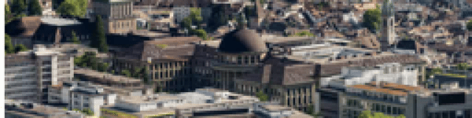
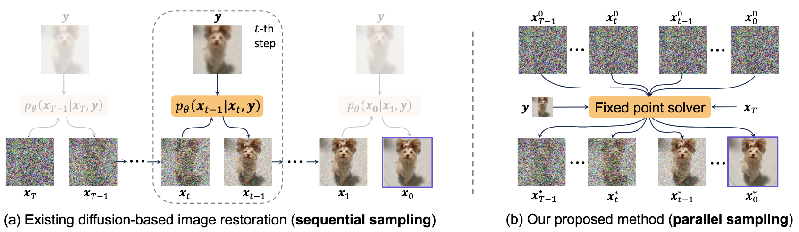
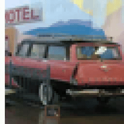
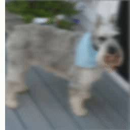
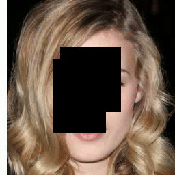
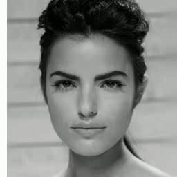

## Deep Equilibrium Diffusion Restoration with Parallel Sampling (CVPR 2024)
[](https://arxiv.org/abs/2311.11600)
[](https://github.com/caojiezhang/DeqIR/releases)


[Jiezhang Cao](https://www.jiezhangcao.com/), [Yue Shi](https://scholar.google.com/citations?user=BrQQHiEAAAAJ&hl=en), [Kai Zhang](https://cszn.github.io/), [Yulun Zhang](http://yulunzhang.com/), [Radu Timofte](https://www.informatik.uni-wuerzburg.de/computervision/), [Luc Van Gool](https://scholar.google.com/citations?user=TwMib_QAAAAJ&hl=en)

Computer Vision Lab, ETH Zurich

---

<p align="center">
    
</p>

> **Abstract:** Diffusion-based image restoration (IR) methods aim to use diffusion models to recover high-quality (HQ) images from degraded images and achieve promising performance. Due to the inherent property of diffusion models, most of these methods need long serial sampling chains to restore HQ images step-by-step. As a result, it leads to expensive sampling time and high computation costs. Moreover, such long sampling chains hinder understanding the relationship between the restoration results and the inputs since it is hard to compute the gradients in the whole chains. In this work, we aim to rethink the diffusion-based IR models through a different perspective, i.e., a deep equilibrium (DEQ) fixed point system. Specifically, we derive an analytical solution by modeling the entire sampling chain in diffusion-based IR models as a joint multivariate fixed point system. With the help of the analytical solution, we are able to conduct single-image sampling in a parallel way and restore HQ images without training. Furthermore, we compute fast gradients in DEQ and found that initialization optimization can boost performance and control the generation direction. Extensive experiments on benchmarks demonstrate the effectiveness of our proposed method on typical IR tasks and real-world settings. 



## 🔗 Contents

- [x] Installation
- [x] Inference
- [x] [Results](#Results)
- [x] [Citation](#Citation)


## Installation

> - Python 3.8.5, PyTorch >= 1.11.0
> - Requirements: see requirements.txt
> - Platforms: Ubuntu 18.04, cuda-11.3

```bash
# download code
git clone https://github.com/caojiezhang/DeqIR
cd DeqIR
pip install -r requirements.txt
```

## Inference

```bash
# usage
python main.py --config {DATASET}.yml --model Diffusion --exp {PROJECT_PATH} --out_name {OUT_NAME} --doc {DATASET} --sample --deg {DEGRADATION} --timesteps {STEPS} --use_svd --etw {etw}

# For example
python main.py --config celeba_hq.yml --model Diffusion --exp experiments/ --out_name outputs_proj --doc celeba --sample --deg 'deblur_gauss' --timesteps 25 --use_svd --etw 0.1
```

## 🔎 Results

We achieved state-of-the-art performance on many image restoration tasks. More results can be found in the paper.

<details>

<p align="center">
  
</p>
<p align="center">
  
</p>
<p align="center">
  
</p>
<p align="center">
  
</p>


</details>

## 📎 Citation

If you find the code helpful in your resarch or work, please cite the following paper(s).

```
@article{cao2024deqir,
    title   = {Deep Equilibrium Diffusion Restoration with Parallel Sampling}, 
    author  = {Jiezhang Cao and Yue Shi and Kai Zhang and Yulun Zhang and Radu Timofte and Luc Van Gool},
    journal = {CVPR},
    year    = {2024},
}
```
